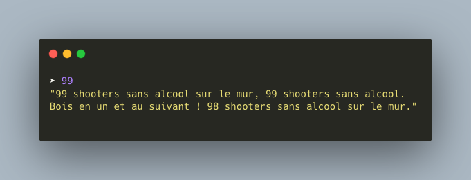
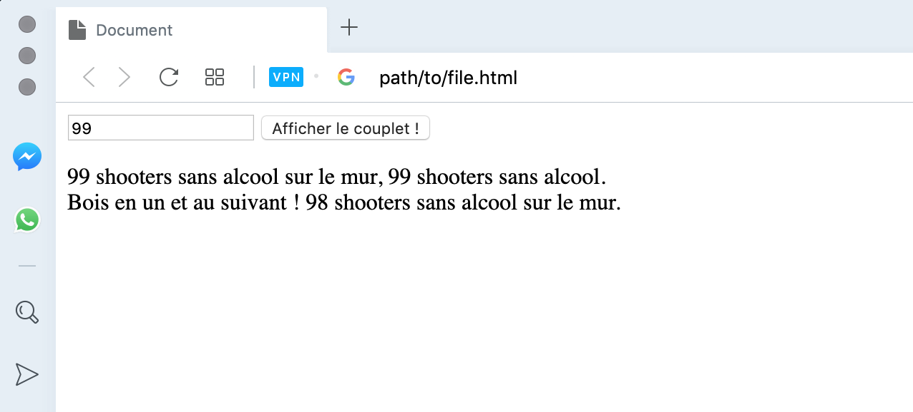

## Règles du jeu

Votre client souhaite que vous réalisiez un programme qui affichera un couplet de sa musique préférée "99 shooters sans alcool" dépendant du nombre de shooters en entré. 
Ce nombre sera compris entre 0 et 99 comme pouvez le [voir ici](SONG.md).

Exemples de solutions :




Pour cela vous êtes libre du langage utilisé ainsi que de l'interface qui permettra à votre client d'interagir avec votre programme.

## Spécifications

**Dans la plupart des cas :**

- [ ] Lorsque je rentre un nombre `n`, j'obtiens le couplet suivant :

```md
`n` shooters sans alcool sur le mur, `n` shooters sans alcool.
Bois en un et passe au suivant, `n - 1` shooters sans alcool sur le mur.
```

**Attention cependant :**

- [ ] Lorsqu'il ne reste qu'un shooter, j'enlève le `s` à shooters.
- [ ] Lorsqu'il n'y a plus de shooters, je remplace `0` par `plus de`.
- [ ] Enfin, si je n'ai plus de shooters je dois aller en acheter :

```md
Plus de shooters sans alcool sur le mur, plus de shooters sans alcool. 
Vas au supermarché pour en acheter, 99 shooters sans alcool sur le mur.
```

**Dans tous les cas :**

- [ ] L'affichage doit respecter le saut de ligne
- [ ] Faire attention aux majuscules en début de phrase

[Voir la musique complète](SONG.md)

## Mot de la fin

...

Bon courage !
